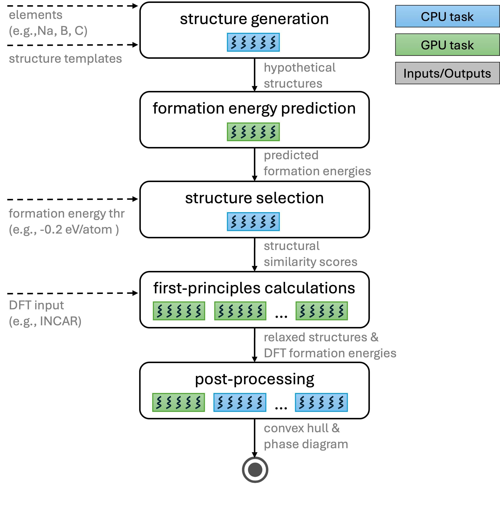

.. _workflow:

======================
Workflow Description
======================

This document presents the `VASP workflow <https://github.com/ML-AMD/exa-amd/blob/main/workflows/vasp_workflow.py>`_ depicted in the figure below, as a representative example of the automated materials discovery workflows implemented in *exa-amd*.

.. _fig-workflow:

   VASP-based workflow.

VASP Workflow Stages
====================

1. Structure generation
-----------------------

Start from structures in the ``initial_structures`` directory and generate hypothetical structures:

- Perform elemental substitution: the elements in each initial structure are replaced with the target elements under investigation.
- Cover atomic arrangements by enumerating (or randomly shuffling) the order of substituted elements (i.e., all permutations for the given system).
- Apply lattice scaling (typically from 0.94 to 1.06) to span realistic bond-length variations, since optimal bond lengths for the new elements may differ from the original structure.
- The cross-product of element orderings and scale factors yields many variants:
  - Ternary: 30 variants per initial structure.
  - Quaternary: 24 possible orderings.

**Inputs**

- Elements (e.g., Na, B, C) specified via JSON config
- Structure templates specified via JSON config

**Outputs**

- Hypothetical structures

**Parsl executor:** ``GENERATE_EXECUTOR_LABEL``

2. CGCNN-based structure screening
----------------------------------

- Evaluate all generated structures with a Crystal Graph Convolutional Neural Network (CGCNN) to predict formation energies efficiently.
- Select structures with low predicted formation energy as promising candidates, reducing the cost of subsequent first-principles calculations.

**Inputs**

- Hypothetical structures
- CGCNN-specific parameters (e.g., batch size) configurable via JSON config

**Outputs**

- Predicted formation energies

**Parsl executor:** ``CGCNN_EXECUTOR_LABEL``

3. Removal of similar structures
--------------------------------

- Identify and remove duplicates or near-duplicates using a structural-similarity threshold. First, candidates are sorted by predicted formation energy, and basic filters (an energy cutoff, optional element-fraction limits, and a maximum-atoms limit) are applied. To identify unique crystal structures, we then group the remaining candidates by their reduced composition. Within each group, the structures are processed from lowest to highest formation energy. A structure is kept for subsequent DFT calculation only if it does not match any previously kept structure from that group, as determined by the :py:class:`pymatgen.analysis.structure_matcher.StructureMatcher` class.
- The deduplication step ensures that only non-equivalent structures are retained, typically narrowing the set to a manageable number (e.g., 1,000–5,000 structures) for detailed study.

**Inputs**

- Structures with associated predicted formation energies
- Formation energy threshold (configurable via JSON config)

**Outputs**

- Structural similarity scores used to further filter the structures

**Parsl executor:** ``SELECT_EXECUTOR_LABEL``

4. DFT calculations (relaxation and energy)
-------------------------------------------

- The filtered set of structures is subjected to first-principles calculations using Density Functional Theory (DFT) with VASP (extensible to other ab initio codes such as Quantum ESPRESSO).
- Each structure undergoes full relaxation to find its lowest-energy geometry, followed by a self-consistent total-energy calculation.
- The resulting relaxed structures and total energies provide the basis for thermodynamic analysis.

**Inputs**

- Selected structures
- DFT input files (``INCAR.rx`` and ``INCAR.en``) from https://github.com/ML-AMD/exa-amd/tree/main/workflows/vasp_assets/

**Outputs**

- Per-job directories containing the calculation artifacts
- Summarized results for converged structures stored in ``vasp_calc_result.csv``

**Parsl executor:** ``VASP_EXECUTOR_LABEL``

5. Post-processing: convex hull and stability analysis
------------------------------------------------------

- Determine the formation energies of each structure relative to known stable phases.
- Construct the convex hull to identify structures that are:
  - Thermodynamically stable: on (or below) the current convex hull.
  - Metastable: low formation energy (< 0.05 eV/atom ) above the hull (Ehull < 0.05 eV/atom).
- This analysis reveals new stable and metastable structures and updates the phase diagram for the target system.

**Inputs**

- Relaxed structures
- DFT formation energies

**Outputs**

- Phase diagram
- Convex hull

**Parsl executor:** ``POSTPROCESSING_LABEL``

Other Workflows
===============

In addition to the VASP workflow shown above, *exa-amd* provides alternative workflow configurations built from reusable steps documented in :doc:`api`. These workflows usually introduce additional stages (e.g., MLIP relaxation).